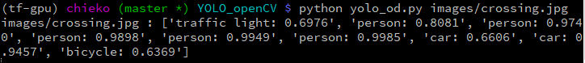

# Python implementation of YOLO v3 using OpenCV

## Overview

This program performs object detection on input images of your choice. I implemented the YOLO v3 model trained on COCO data set using functions provided by OpenCV library.

## Source files

 - `yolo_od.py` : Python file. This is the main file for this program.
 - `yolo_od_utils.py` : Python file. This contains subfunctions.

## Input files

 - `yolo/coco.names` : COCO class lists
 - `yolo/yolov3.cfg` : YOLO v3 config file
 - `yolo/yolov3.weights` : YOLO v3 weights file (I couldn't put this file in GitHub because it's too big (273 MB). You need to download it from https://pjreddie.com/media/files/yolov3.weights)

These files were obtained by following the instruction described in **Darknet**'s ["YOLO: Real-Time Object Detection"](https://pjreddie.com/darknet/yolo/)

## Version

  - Python 3
  - Numpy 1.14.3
  - OpenCV 3.4.2

## Usage

After you download those files above, simply execute the command below in the directory where 'yolo_od.py' is located.
```
 > python yolo_od.py <image files ...>
```

Before you run this command, you need to prepare image files you want to try out. It's possible to specify multiple image files. If you do so, it performs object detection on each image file in a row.

When you run this program, the image with bounding boxes is shown in the window, and you can see the result. To close the output image, you need to put the mouse pointer on the window and press any key. If you specify multiple image files, the output images are shown one by one.

You can set the confidence threshold and IoU threshold for Non-max supression:

 - `-c <float>` or `--confidence <float>` : confidence threshold
 - `-t <float>` or `--threshold <float>` : IoU Threshold

The value of both parameters should be between 0.0 to 1.0. The default value is 0.5.

example)
```
  > python yolo_od.py -c 0.4 -t 0.3 my_imagefile.jpg
```

### Example1

This is an example picturing a crossing in Perth CBD (I took this photo!).


The result (which things were detected?) is also displayed on the terminal:



### Example2

Here's another example. This is a photo of a lunch I had at [my favorite cafe](https://www.facebook.com/florafaunaperth/) one day!


Sadly, some of the box labels are out of image. But we can know about the objects detected on the terminal as well.


## Notes

 - For this YOLO v3 implementation with OpenCV, I mainly referred to the tutorial **"YOLO object detection with OpenCV
by Adrian Rosebrock"** (https://www.pyimagesearch.com/2018/11/12/yolo-object-detection-with-opencv/). This is a great tutorial.

 - I include a **jupyter notebook** (`yolo_od.ipynb`) in this repository. I first tried this implementation in the notebook. It contains notes and explanations about the algorithms as well as about the points I had to care with respect to the YOLO v3 architecture.

 - First I tried using Non-max suppression using `cv2.dnn.NMSBoxes()`, but the kernel died always when I ran the function. So I decided to implement Non-max suppression by myself. The algorithm of NMS is taken from the idea that was explained in the [Coursera's Deep Learning Specialization "4.Convolutional Neural Networks"](https://www.coursera.org/learn/convolutional-neural-networks?specialization=deep-learning) I had learned.

 - To understand the YOLO v3 architecture, the article **"What's new in YOLO v3?"**(https://towardsdatascience.com/yolo-v3-object-detection-53fb7d3bfe6b) was very helpful.

 - In this program, sometimes the object labels attached to the bounding boxes come out of the image. In this case, we can't know the labels and probabilities of the objects detected. I would like to address this problem in the future.
